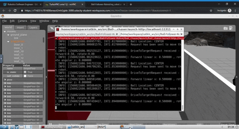
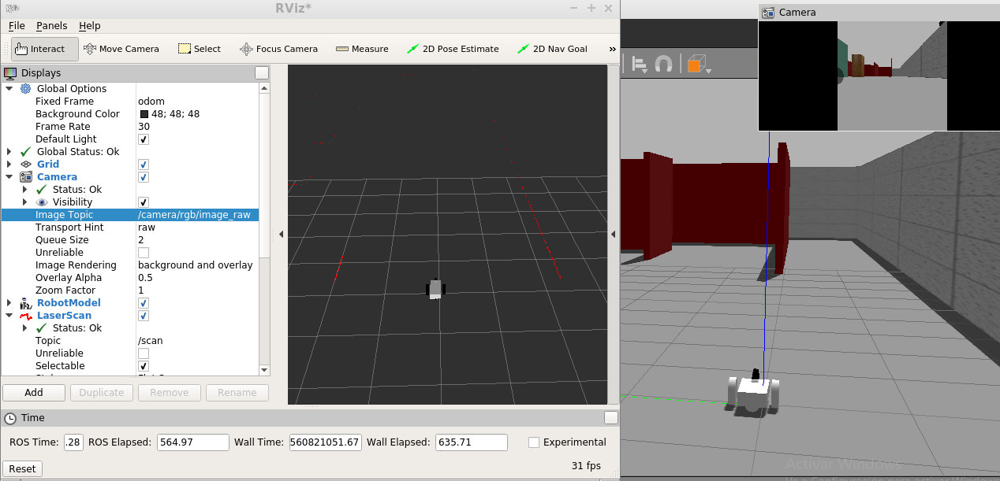

# Ball Follower Robot
This repo explain the process of localizing a white ball through a robot's onboard camera and driving a differential robot torwards the ball. This repo uses [Udacity's RoboND-simple_arm repo](https://github.com/udacity/RoboND-Simple_arm) as a guide for the pub-sub architecture. 



### Directory Structure

#### ROS Packages 
- `my_robot` holds the robot physical design and pluggins to interact with actuators and sensors.
- `ball_chaser`holds the nodes in charge of localizing a white ball and driving the bot torwards the ball.

#### ROS Nodes
- `drive_bot` This server node will provide a ball_chaser/command_robot service to drive the robot around by controlling its linear x and angular z velocities. The service will publish a message containing the velocities to the wheel joints.
- `process_image` This client node will subscribe to the robot’s camera images and analyze each image to determine the position of the white ball (left center or right section of screen). Once ball position is determined, the client node will request a service to drive the robot either left, right or forward.

#### Gazebo Preexisting Plugins
Shared object file created from compiling C++ source code. They allow interaction with Rviz and Gazebo.
- `libgazebo_ros_diff_drive.so` is the plugin for the wheel joints. It accepts information from the robot's model: joint names, link dimensions, etc to calculate and publish the robot's odometry informtion to the topic that you specify. In our case cmd_vel topic
- `libgazebo_ros_camera.so` is the plugin for the camera sensor. It requires the camera urdf link name and it publishes to the camera topic: /camera/rgb/image_raw topic.
- `libgazebo_ros_laser.so` is the plugin for the hokuyo lidar. It requires hokuyo urdf link name and it publishes to the hokuyo topic: /scan.


### Steps to Launch Simulation
#### Create a catkin_ws (unless you already have one!)
/home/workspace can be any directory you want
```sh
$ cd /home/workspace/
$ mkdir -p catkin_ws/src/
$ cd catkin_ws/src/
$ catkin_init_workspace
```

#### Clone the repo in catkin_ws/src/
```sh
$ cd /home/workspace/catkin_ws/src/
$ git clone https://github.com/laygond/Ball-Follower-Robot.git
```

#### Install packages Dependencies
```sh
$ cd /home/workspace/catkin_ws
$ source devel/setup.bash
$ rosdep -i install my_robot
$ rosdep -i install process_image
```

#### Build packages
```sh
$ cd /home/workspace/catkin_ws/ 
$ catkin_make
$ source devel/setup.bash
```

### Part 1: Interact with robot

#### Launch simulation: load robot in Gazebo and Rviz
From anywhere inside catkin_ws
```sh
$ roslaunch my_robot world.launch
```

#### Read RViz Sensor Stream
Setup RViz to visualize the sensor readings. On the left side of RViz, under Displays:

- Select odom for fixed frame
- Click the Add button located in the bottom and
- add RobotModel and your robot model should load up in RViz.
- add Camera and select the Image topic that was defined in the camera Gazebo plugin: /camera/rgb/image_raw
- add LaserScan and select the topic that was defined in the Hokuyo Gazebo plugin: /scan



Sensor stream can be called from terminal as well. For example for camera:
```sh
$ rosrun image_view image_view image:=/camera/rgb/image_raw
```

#### Drive robot around (Optional)
There are two options to acomplish this.

##### Publishing Directly
Open a new terminal window and publish velocity commands directly to the robot's wheel actuators. To stop vehicle publish zero values and then Ctrl + C.
```sh
$ cd /home/workspace/catkin_ws/
$ source devel/setup.bash
$ rostopic pub /cmd_vel geometry_msgs/Twist  "linear:
  x: 0.1
  y: 0.0
  z: 0.0
angular:
  x: 0.0
  y: 0.0
  z: 0.1" 
```
##### Calling the Service
The other option is to test the service by requesting different sets of velocities from the terminal.

Run the drive_bot node only
```sh
$ cd /home/workspace/catkin_ws/
$ source devel/setup.bash
$ rosrun ball_chaser drive_bot
```

Open a new terminal while all the nodes are running and type:
```sh
$ cd /home/workspace/catkin_ws/
$ source devel/setup.bash
$ rosservice call /ball_chaser/command_robot "linear_x: 0.5
angular_z: 0.0"  # This request should drive your robot forward
```

### Part 2: Activate Ball Follower
#### Launch remaining nodes
From anywhere inside catkin_ws run drive_bot and process_image nodes. This can be done by executing ball_chaser.launch:
```sh
$ cd /home/workspace/catkin_ws/
$ source devel/setup.bash
$ roslaunch ball_chaser ball_chaser.launch
```


