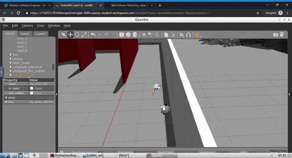

# Adaptive Monte Carlo Localization ROS
This repo utilize ROS AMCL package to accurately localize a mobile robot inside a map in the Gazebo simulation environments. The 2D ground truth map is created from the Gazebo simulation using [`pgm_map_creator`](https://github.com/udacity/pgm_map_creator) ROS package and the localization is performed by the `where_am_i` ROS package. This repo uses the [Ball-Follower-Robot repo](https://github.com/laygond/Ball-Follower-Robot) as a starting point.


<b>Localization:</b> Get the robot's pose, given a map of the environment.  
<b>Adaptive:</b> dynamically adjusts the number of particles over a period of time, as the robot navigates around in a map.

## Directory Structure
```
.Ball-Follower-Robot
|-- README.md
|-- README_images				# Images used by README.md
|   `-- ...
|-- ball_chaser
|   |-- CMakeLists.txt				# Compiler Instructions
|   |-- package.xml				# Package Info
|   |-- launch
|   |   `-- ball_chaser.launch			# Launches nodes from this package
|   |-- src					# Source Folder: Nodes
|   |   |-- drive_bot.cpp
|   |   `-- process_image.cpp
|   `-- srv					# Service Folder
|       `-- DriveToTarget.srv
`-- my_robot
    |-- CMakeLists.txt				# Compiler Instructions
    |-- package.xml				# Package Info
    |-- launch
    |   |-- robot_description.launch		# Used by world.launch to launch robot
    |   `-- world.launch			# Launches world & robot in Gazebo and Rviz 
    |-- meshes					# Used in my_robot.xacro for visual appearance
    |   |-- camera.dae
    |   `-- hokuyo.dae
    |-- urdf
    |   |-- my_robot.gazebo			# Gazebo Plugins: Robot's sensors
    |   `-- my_robot.xacro			# Robot 
    `-- worlds
        |-- empty.world				# Extra world
        `-- my_sexy_world.world			# Main world
```

#### ROS Packages 
- `my_robot` holds the robot physical design and pluggins to interact with actuators and sensors.
- `pgm_map_creator`  
`ball_chaser`holds the nodes in charge of localizing a white ball and driving the bot torwards the ball.
- `where_am_i` uses the final output map along with its metadata to localize a robot's pose using [ROS AMCL package](http://wiki.ros.org/amcl)
#### ROS Nodes
- `drive_bot` This server node will provide a ball_chaser/command_robot service to drive the robot around by controlling its linear x and angular z velocities. The service will publish a message containing the velocities to the wheel joints.
- `process_image` This client node will subscribe to the robot’s camera images and analyze each image to determine the position of the white ball (left center or right section of screen). Once ball position is determined, the client node will request a service to drive the robot either left, right or forward.

where_am_i add nodes through its amcl.launch file
- [map_server node] (http://wiki.ros.org/map_server) provides map data as a ROS service to other nodes such as the amcl node. Here, map_server node will locate the map you created and send it out as map data.
- [amcl node] takes odometry and laser scan data to perform the AMCL localization.

You have two options to control your robot while it localize itself here:
- Send navigation goal via RViz
- Send move command via teleop package.

- [move_base node] uses a navigation goal position provided either through RViz or terminal so that the robot will navigate to that goal position. 
It utilizes a costmap - where each part of the map is divided into which area is occupied, like walls or obstacles, and which area is unoccupied. As the robot moves around, a local costmap, in relation to the global costmap, keeps getting updated allowing the package to define a continuous path for the robot to move along.

What makes this package more remarkable is that it has some built-in corrective behaviors or maneuvers. Based on specific conditions, like detecting a particular obstacle or if the robot is stuck, it will navigate the robot around the obstacle or rotate the robot till it finds a clear path ahead.

Teleop Package
If you prefer to control your robot to help it localize itself as you did in the lab, you would need to add the teleop node to your package. Thanks to the ROS community, we could use ros-teleop package to send command to the robot using keyboard or controller.


#### Gazebo Preexisting Plugins
Shared object file created from compiling C++ source code. They allow interaction with Rviz and Gazebo.
- `libgazebo_ros_diff_drive.so` is the plugin for the wheel joints. It accepts information from the robot's model: joint names, link dimensions, etc to calculate and publish the robot's odometry informtion to the topic that you specify. In our case cmd_vel topic
- `libgazebo_ros_camera.so` is the plugin for the camera sensor. It requires the camera urdf link name and it publishes to the camera topic: /camera/rgb/image_raw topic.
- `libgazebo_ros_laser.so` is the plugin for the hokuyo lidar. It requires hokuyo urdf link name and it publishes to the hokuyo topic: /scan.

## Project Overview
- Set up environment and robot
- Generate ground truth map from Gazebo World
- Build AMCL launch file
- Select proper localization parameters
- Add teleop node (Optional)

By default, AMCL package will treat 'darker' pixels as obstacle in the pgm map file, and 'lighter' pixels as free space. The threshold could be set as a parameter which we will cover when we are building the launch file.


## Map Creation
We need a map so that `where_am_i` package can use it for localization. Use the Directory Structure to guide yourself thoughout this section.
We will make use of files from the following packages in the this order:
- my_robot
- pgm_map_creator
- where_am_i

#### Steps
- Place a copy of the Gazebo world from `my_robot` in the world folder from `pgm_map_creator`
- In `pgm_map_creator` add the map creator plugin tag towards the end of the copied map file (just before </world> tag):
```
<plugin filename="libcollision_map_creator.so" name="collision_map_creator"/>
```
- In `pgm_map_creator` create a map inside the map folder using the world from the world folder by doing this:
Open a terminal at your pgm_map_creator directory level and run gzerver with the edited world file:
```sh
gzserver world/<YOUR GAZEBO WORLD FILE>
```
Open another terminal anywhere inside catkin_ws, launch the request_publisher node
```sh
roslaunch pgm_map_creator request_publisher.launch
```
- Do a quick check of the map inside map folder. If the map is cropped, you might want to adjust the parameters in `launch/request_publisher.launch`, namely the x and y values, which defines the size of the map:
```
  <arg name="xmin" default="-15" />
  <arg name="xmax" default="15" />
  <arg name="ymin" default="-15" />
  <arg name="ymax" default="15" />
  <arg name="scan_height" default="5" />
  <arg name="resolution" default="0.01" />
  ```
Remember, the map is a [pgm file](https://en.wikipedia.org/wiki/Netpbm_format), which is simply a grayscale image file, which means you could edit it using image processing softwares.
- Place a copy of the map file from `pgm_map_creator` in the map folder from `where_am_i`
- Finally, in the map folder from `where_am_i`, create a yaml file providing the metadata about the map. 
The metadata is needed by `where_am_i` so that its AMCL can treat 'darker' pixels as obstacle in the pgm map file, and 'lighter' pixels as free space. The threshold could be set as a parameters.
In your map yaml file add the following lines:
```
image: <YOUR MAP NAME>
resolution: 0.01
origin: [-15.0, -15.0, 0.0]
occupied_thresh: 0.65
free_thresh: 0.196
negate: 0
```
Note: if the default map size is 30 by 30, the origin will be [-15, -15, 0]

## Steps to Launch Simulation
Before we start, if you are working with a native ROS installation or using a VM, some of the following package might need to be installed. You could install them as shown below:
```sh
sudo apt-get install ros-kinetic-navigation
sudo apt-get install ros-kinetic-map-server
sudo apt-get install ros-kinetic-move-base
sudo apt-get install ros-kinetic-amcl
sudo apt-get install libignition-math2-dev protobuf-compiler
```
### Create a catkin_ws (unless you already have one!)
`/home/workspace` can be any directory you want
```sh
$ cd /home/workspace/
$ mkdir -p catkin_ws/src/
$ cd catkin_ws/src/
$ catkin_init_workspace
```

### Clone the repo in catkin_ws/src/
```sh
$ cd /home/workspace/catkin_ws/src/
$ git clone https://github.com/laygond/Ball-Follower-Robot.git
```

### Install packages Dependencies
```sh
$ cd /home/workspace/catkin_ws
$ source devel/setup.bash
$ rosdep -i install my_robot
$ rosdep -i install process_image
```

### Build packages
```sh
$ cd /home/workspace/catkin_ws/ 
$ catkin_make
$ source devel/setup.bash
```
---
## Part 1: Interact with robot

### Launch simulation: load robot in Gazebo and Rviz
From anywhere inside catkin_ws
```sh
$ roslaunch my_robot world.launch
```

### Read RViz Sensor Stream
Setup RViz to visualize the sensor readings. On the left side of RViz, under Displays:

- Select odom for fixed frame
- Click the Add button located in the bottom and
- add RobotModel and your robot model should load up in RViz.
- add Camera and select the Image topic that was defined in the camera Gazebo plugin: /camera/rgb/image_raw
- add LaserScan and select the topic that was defined in the Hokuyo Gazebo plugin: /scan


Sensor stream can be called from terminal as well. For example for camera:
```sh
$ rosrun image_view image_view image:=/camera/rgb/image_raw
```

### Drive robot around (Optional)
There are two options to acomplish this.

#### Publishing Directly
Open a new terminal window and publish velocity commands directly to the robot's wheel actuators. To stop vehicle publish zero values and then Ctrl + C.
```sh
$ cd /home/workspace/catkin_ws/
$ source devel/setup.bash
$ rostopic pub /cmd_vel geometry_msgs/Twist  "linear:
  x: 0.1
  y: 0.0
  z: 0.0
angular:
  x: 0.0
  y: 0.0
  z: 0.1" 
```
#### Calling the Service
The other option is to test the service by requesting different sets of velocities from the terminal.

Run the drive_bot node only
```sh
$ cd /home/workspace/catkin_ws/
$ source devel/setup.bash
$ rosrun ball_chaser drive_bot
```

Open a new terminal while all the nodes are running and type:
```sh
$ cd /home/workspace/catkin_ws/
$ source devel/setup.bash
$ rosservice call /ball_chaser/command_robot "linear_x: 0.5
angular_z: 0.0"  # This request should drive your robot forward
```

## Part 2: Activate Ball Follower
### Launch remaining nodes
From anywhere inside catkin_ws run drive_bot and process_image nodes. This can be done by executing ball_chaser.launch:
```sh
$ cd /home/workspace/catkin_ws/
$ source devel/setup.bash
$ roslaunch ball_chaser ball_chaser.launch
```


